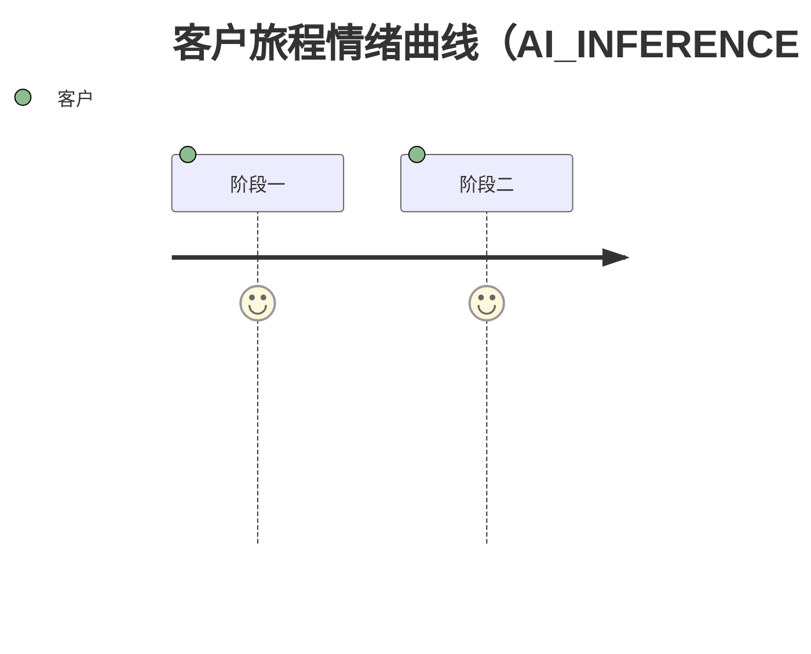

# 用户旅程

> 项目/需求：待确认
> 一句话旅程叙事：待确认
> 治理伴随文件：user-journey.governance.md
> 默认审阅板：user-journey.board.html（Figma 风中性模板，复制 `assets/user-journey-board.html` 后只替换 DATA 对象；详见 `references/html-journey-board.md` 数据契约。生成触发条件见 SKILL.md §5 Generate「HTML 审阅板触发条件」段——本 skill 默认生成，仅在单角色/单阶段/单路径且 PM 未要求可视化时跳过。）
>
> **设计风格一致性**：HTML 审阅板视觉风格（顶部 sticky 工具条 / Frame 块 / 水平时间线 / MOT 节点金色光晕 / 路径类型 6 态边框 / 暗色模式）与 skill 产物（`user-journey.md` 嵌入的 HTML 产物、对比报告、UJ 治理文件、open-source 镜像）保持一致——避免 HTML 与 markdown 视觉规范漂移。

## 预检与摘要

- 上游背景目标：待确认
- 输入成熟度：待确认（L0 / L1 / L2 / L3 / L4）
- 已确认角色：待确认
- 已知生命周期线索：待确认
- 材料明确的高层业务事件：待确认
- AI 对旅程的高层理解：待确认

## 一句话旅程叙事

待确认。用角色和业务结果描述“从什么触发，到什么结果”，不要用“使用某页面/某功能”描述。

## 业务生命周期分解

| 阶段 | 触发事件 | 角色与业务目标 | 可观察结果 | 来源概述 |
|---|---|---|---|---|
| 待确认 | 待确认 | 待确认 | 待确认 | 待确认 |

**旅程总览图（mermaid，必画）**——把上表转成 `flowchart LR`，一眼看清主路径与分支；这是产物的「直观层」，禁止只交表格不交图：

```mermaid
flowchart LR
  %% 用真实阶段与节点替换；分支用菱形节点；异常/失败用虚线
```

## 角色旅程矩阵

### 角色：待确认

> **画像 3 件套**（来自 BRD 常见做法）：每个角色建一份画像，让旅程有针对性。材料无证据时标「待确认 / TBC」，不编造。

- **人口属性**：年龄段 / 设备 / 地域 / 身份（VIP / 新客 / 员工 / 携伴 等）
- **行为特征**：使用频率 / 单次时长 / 触点偏好 / 决策路径
- **核心诉求**：在本次旅程中希望完成的事 / 关心什么

角色目标：待确认

| 阶段 | 触发与行为 | 触点/交接 | 结果与阻碍 | 路径类型 |
|---|---|---|---|---|
| 待确认 | 待确认 | 待确认 | 待确认 | normal / alternative / exception / failure / handoff / recovery |

### 产品层展开（granularity = business+product 时）

若 frontmatter `granularity` 含 `product`，请在角色旅程矩阵下用子表分开，并按以下建议子块逐块落地（每块与 `references/journey-extraction-guardrails.md` 逐条核对）：

1. **通知/提醒形态枚举清单**：外部渠道（短信 / 邮件 / 服务号消息 / …）+ 站内提醒（红点 / 标签 / 弹窗 / Reminder 等）逐条枚举，每条含材料定位、已知规则、旅程落点、证据；流程图中独立出现的提示节点（如 Receive a reminder）单独登记并追问规则，**不并入已知形态**。
2. **多品类对照表**（材料含多品类并列页时必含）：行 = 维度（信息字段 / 功能入口 / 信息入口 / 删除入口 / 内容法务待办），列 = 品类；矩阵节点归并保留"品类适用范围"列。
3. **分支骨架与空态矩阵**（旅程含资产对象或受身份/登录态控制时必含）：身份 × 登录 × 资产状态组合 → 影响的旅程节点 → 材料给出的去向；TBC 也先画骨架并明示"骨架≠裁决"，不替上游裁决。
4. **占位符登记**：文案含动态变量（XX / 性别称谓 / 落地链接 / 退订指令等）需登记清单与口径待确认，供下游 BRD 直接认领。
5. **用户故事种子**（粒度含 product 时建议含；下游 user-stories skill 的稳定输入接口）：每个产品层步骤映射至少一条候选用户故事种子；同一目的多入口拆分为多个独立故事时标注拆分理由与下游开发工作量提示。

   字段约定：

   - **ST-ID**：与下游 user-stories skill 的 `ST-XXX` 标识符对齐；上游 UJ 可用前缀占位如 `ST-UJ-001`，下游正式落地时再确认 ID
   - **入口**：`<interaction>-<touchpoint>` 格式（参见 `references/touchpoint-coverage-matrix.md`）
   - **故事描述**：标准叙事句（角色 + 目标 + 业务结果），不写成按钮/页面/接口
   - **拆分理由**：多入口差异、跨渠道差异、用户角色差异等导致拆分的具体原因
   - **是否需要页面级设计**：是 / 否（为下游 page-design / 原型环节预留钩子）
   - **是否需要原型**：是 / 否

   子表格式（每个产品层节点后追加；可折叠）：

   ```markdown
   #### <产品层节点名>：候选用户故事种子

   | 候选故事 ID | 入口 | 故事描述 | 拆分理由 | 页面级设计 | 原型 |
   |---|---|---|---|---|---|
   | ST-UJ-001 | `<interaction>-<touchpoint>` | <角色> + <目标> + <业务结果> | （多入口 / 跨渠道 / 角色差异） | 是 / 否 | 是 / 否 |
   | ST-UJ-002 | `<interaction>-<touchpoint>` | ... | ... | ... | ... |
   ```

   **重要约束**：

   - AI 可以基于旅程节点生成 ST-ID 占位与故事描述草稿；但**拆分理由**与**页面级设计 / 原型**字段在 `status != confirmed` 时默认为「待确认」，由 PM 在 Generate 阶段勾选——AI 不替 PM 决定是否需要页面级设计或原型
   - 同一目的多入口（如"查看 DP 详情"短信 3 步 vs 邮件 4 步）必须**拆为多个独立 ST-ID**，并在拆分理由中标明"渠道差异"
   - **本 skill 不产出最终 ST-XXX**：UJ 阶段的 ST-ID 是「种子」，下游 user-stories skill 在 Generate 时按种子落最终 ST-ID；UJ 校验器对 ST-ID 格式仅做 advisory 检查（uj.seed_missing / uj.seed_id_format）
6. **入口对比视图（按需生成）**：基础字段「已选入口清单」+ 可选「入口对比表」。按需触发的视图，不是默认结构——避免 AI 自作主张枚举入口，违背「不猜测」原则。
   - **已选入口清单**（基础字段，必填）：PM 显式登记的入口集合，按用户目的分组；同一目的多入口必须登记为多项
     ```markdown
     | 用户目的 | 已选入口（`<interaction>-<touchpoint>`） | 登记理由 |
     |---|---|---|
     | 查看 DP 详情 | `reminder_dp-sms_3rd_party`, `reminder_dp-email_trans`, `reminder_dp-inapp_reminder_center` | 短信 / 邮件 / 站内信 三渠道并列 |
     | 权益认领 | `confirm_arrival-inapp_modal` | 仅应用内入口（PM 决策） |
     ```
   - **入口对比表**（可选视图，触发条件：清单中任一用户目的有 ≥ 2 个入口时）：由 AI 检测到后**主动提示 PM**「检测到用户目的 `<X>` 有 N 个入口，是否生成对比视图？」，PM 确认后才生成。视图字段：
     ```markdown
     ### 入口对比视图：<用户目的 X>

     | 入口 | 步骤数 | 关键差异 | 待确认项 |
     |---|---|---|---|
     | `reminder_dp-sms_3rd_party` | 3 | 短信外链 → 短链跳转 | 短链规则、退订指令 |
     | `reminder_dp-email_trans` | 4 | 邮件内链 → 深链 + 二次确认 | 邮件模板、附件规则 |
     | `reminder_dp-inapp_reminder_center` | 2 | 应用内直达，免登录态 | 应用版本兼容 |
     ```
   - **约束**：
     - 已选入口清单是基础字段（每份含粒度含 product 的产物必填，未填则在「已选入口清单」段标 `待确认`）
     - 入口对比表是可选视图，AI 不替 PM 决定是否生成；触发条件命中时必须主动提示
     - 校验器对入口对比表缺失不阻断，但 seed 里有 ≥ 2 个同目的入口时发 advisory 提示（uj.comparison_view_suggested）

每个子块须写明材料定位（页/节点/行号）与证据状态（FACT / DECISION / ASSUMPTION / AI_INFERENCE / UNKNOWN / CONFLICT）；缺证据的格子标 `待确认` 或 `UNKNOWN`，不替上游补全。

## 路径与情绪

### 路径覆盖

| 路径类型 | 当前覆盖 | 旅程位置 | 缺口或限制 |
|---|---|---|---|
| normal | 待确认 | 待确认 | 待确认 |
| alternative | 待确认 | 待确认 | 待确认 |
| exception | 待确认 | 待确认 | 待确认 |
| failure | 待确认 | 待确认 | 待确认 |
| handoff | 待确认 | 待确认 | **挂对方侧骨架**（进入点 / 可见内容版本 / 失效去向；材料未覆盖处显式声明）或**显式声明对方侧材料未覆盖**——不允许空白 |
| recovery | 待确认 | 待确认 | 待确认 |

### 情绪与可观察信号

> 区分**定性信号**（可观察行为/情绪线索）与**定量指标**（可量化数据）。材料无数据时标 UNKNOWN，不编造。

| 阶段 | 角色 | 可观察信号（定性） | 关键指标（定量） | 证据或未知 |
|---|---|---|---|---|
| 待确认 | 待确认 | 待确认 | 转化率 / 停留时长 / 跳出率 / 满意度 / 留存 等（具体待填） | 待确认 |

**情绪曲线图（mermaid journey，必画）**——把上表按阶段转成 `journey` 图（满意度 1-10 评分），材料无情绪证据时按路径类型推导并标注 AI_INFERENCE（normal/alternative=7，handoff/exception/recovery=5，failure=3）；曲线比表格直观，一眼看到体验低谷：




## 触点、痛点与机会

| ID | 阶段 × 角色 | 触点与行为 | 痛点/阻碍 | 机会（业务结果） |
|---|---|---|---|---|
| UJ-001 | 待确认 | 待确认 | 待确认 | 待确认 |

### 系统级 UI 提示机制（护栏 ⑥，无则写「无」并保留段头）

| 提示机制 | 触发场景 | 是否可配置 | 默认态 | 影响范围 | 材料定位 |
|---|---|---|---|---|---|
| 待确认 | 待确认 | 待确认 | 待确认 | 待确认 | 待确认 |

### 按用户态切换的 UI 元素（护栏 ⑦，无则写「无」并保留段头）

| 触发条件 | UI 元素 | 材料定位 |
|---|---|---|
| 待确认 | 待确认 | 待确认 |

### CTA 动态配置（护栏 ⑧，无则写「无」并保留段头）

| CTA 文案 | 是否可配 | 配置维度 | 默认态 | 材料定位 |
|---|---|---|---|---|
| 待确认 | 待确认 | 待确认 | 待确认 | 待确认 |

### 系统生成物（护栏 ⑨，无则写「无」并保留段头）

| 生成物 | 生成维度 | 有效期 | 生成方 | 消费方 | 材料定位 |
|---|---|---|---|---|---|
| 待确认 | 待确认 | 待确认 | 待确认 | 待确认 | 待确认 |

## 入口生命周期（护栏 ⑪，四列）

| 入口 | 现有 / 新增 / 已删除 / 待定 | 触发场景 | 撤销/关闭条件 | 材料定位 |
|---|---|---|---|---|
| 待确认 | 待确认 | 待确认 | 待确认 | 待确认 |

## 阶段 ↔ User Story 映射表（护栏 ⑫）

> 旅程用生命周期阶段；需求方用 User Story 编号；两套坐标系必须建一对多映射表，下游 user-stories skill 凭映射认领。

| 旅程阶段 | User Story 编号 | 关系（1:N） | 备注 |
|---|---|---|---|
| 待确认 | ST-XXX, ST-XXX | 多对一 | 待确认 |

## 旅程覆盖与边界

- 已覆盖：待确认
- 材料明确但尚未纳入旅程的相邻阶段：待确认
- 本次不判断的内容（功能、页面、字段、接口、实现）：待确认
- 与其他角色或系统的交界：待确认

## 待确认与风险

- 待确认：待确认

## 参考资料

- 待确认：列出本次实际使用的上游产物、会议、PPT、PDF、图片或现状材料的标题、日期和位置。
